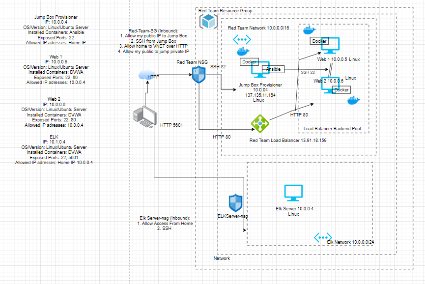

## Automated ELK Stack Deployment

The files in this repository were used to configure the network depicted below.

These files have been tested and used to generate a live ELK deployment on Azure. They can be used to either recreate the entire deployment pictured above. Alternatively, select portions of the ELK YAML file (elk_playbook.yml) file may be used to install only certain pieces of it, such as Filebeat.

  - [elk_playbook.yml](Ansible/elk_playook.yml)

This document contains the following details:
- Description of the Topology
- Access Policies
- ELK Configuration
  - Beats in Use
  - Machines Being Monitored
- How to Use the Ansible Build

### Description of the Topology

The main purpose of this network is to expose a load-balanced and monitored instance of DVWA, the D*mn Vulnerable Web Application.

Load balancing ensures that the application will be highly available, in addition to restricting traffic to the network.
- Load balancers protect availability. Load balancers distribute network traffic across multiple servers. A load balancer can protect from DoS attacks. A jump box adds a security layer to the web servers by preventing them from being exposed to the public. 

Integrating an ELK server allows users to easily monitor the vulnerable VMs for changes to the metrics and system files.
- Filebeat watches for log files and log events. Filebeat collects data about the file system. Filebeat watches for when and if a file changes.
- Metricbeat collects machine metrics. 

The configuration details of each machine may be found below.
_Note: Use the [Markdown Table Generator](http://www.tablesgenerator.com/markdown_tables) to add/remove values from the table_.

| Name     | Function | IP Address | Operating System |
|----------|----------|------------|------------------|
| Jump Box | Gateway  | 10.0.0.4   | Linux            |
| Web 1    | Webserver| 10.0.0.5   | Linux            |
| Web 1    | Webserver| 10.0.0.6   | Linux            |
| Elk      | Monitor  | 10.1.0.4   | Linux            |

### Access Policies

The machines on the internal network are not exposed to the public Internet. 

Only the Jumpbox Provisioner machine can accept connections from the Internet. Access to this machine is only allowed from the following IP addresses:
- My public IP. 

Machines within the network can only be accessed by Jumpbox Provisioner.
- ELK VM can only be accessed by JumpBox Provisioner (10.0.0.4) through SSH and my home machine (home public IP). 

A summary of the access policies in place can be found in the table below.

| Name     | Publicly Accessible | Allowed IP Addresses |
|----------|---------------------|----------------------|
| Jump Box | Yes                 |  Home IP             |
| Web 1    | No                  |  10.0.0.4            |        
| Web 2    | No                  |  10.0.0.4            |        
| ELK      | Yes (http)          |  Home IP , 10.0.0.4  |                

### Elk Configuration

Ansible was used to automate configuration of the ELK machine. No configuration was performed manually, which is advantageous because ansible containers allow flexibility due to being able to make changes within any of the VMs associated with it. 

The playbook implements the following tasks:
- Install Docker.io
- Install python3-pip 3
- Install Docker Python Module
- Download and launch a docker web container

The following screenshot displays the result of running `docker ps` after successfully configuring the ELK instance.

### Target Machines & Beats
This ELK server is configured to monitor the following machines:
- Web 1(10.0.0.5) Web 2 (10.0.0.6)

We have installed the following Beats on these machines:
- Filebeats and MetricBeats

These Beats allow us to collect the following information from each machine:
- Metricbeat collects metric data from my target servers, this could be operating system metrics such as CPU or memory or data related to services running on the server. It can also be used to monitor other metrics and ELK stack itself. Filebeeats collects log data for files that have been accessed and the server's response. 

### Using the Playbook
In order to use the playbook, you will need to have an Ansible control node already configured. Assuming you have such a control node provisioned: 

SSH into the control node and follow the steps below:
- Copy the elk-playbook.yml file to /etc/ansible/roles/install-elk/tasks.
- Update the host file to include the IP of the elk machine. 
  -[webservers]
    #alpha.example.org
    #beta.example.org
    #192.168.1.100
    #192.168.1.11
    10.0.0.5 ansible_python_interpreter=/usr/bin/python3
    10.0.0.6 ansible_python_interpreter=/usr/bin/python3
    [elk]
    10.1.0.4 ansible_python_interpreter=/usr/bin/python3
- Run the playbook, and navigate to Kibana (52.186.105.211:5601) to check that the installation worked as expected.

_TODO: Answer the following questions to fill in the blanks:_
- _Which file is the playbook? Where do you copy it?_ elk-playbook.yml. Copied into etc/ansible/roles/install-elk/tasks
- _Which file do you update to make Ansible run the playbook on a specific machine? How do I specify which machine to install the ELK server on versus which to install Filebeat on?_ Edit hosts file to include the specific machine. Specify the group by bracketing it. etc/ansible/hosts

